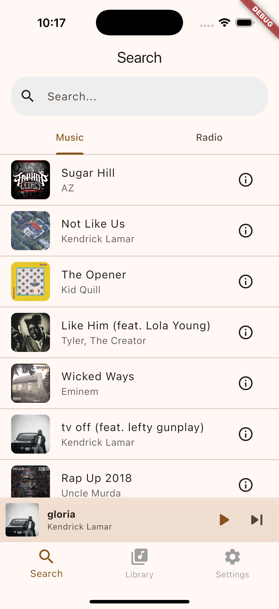
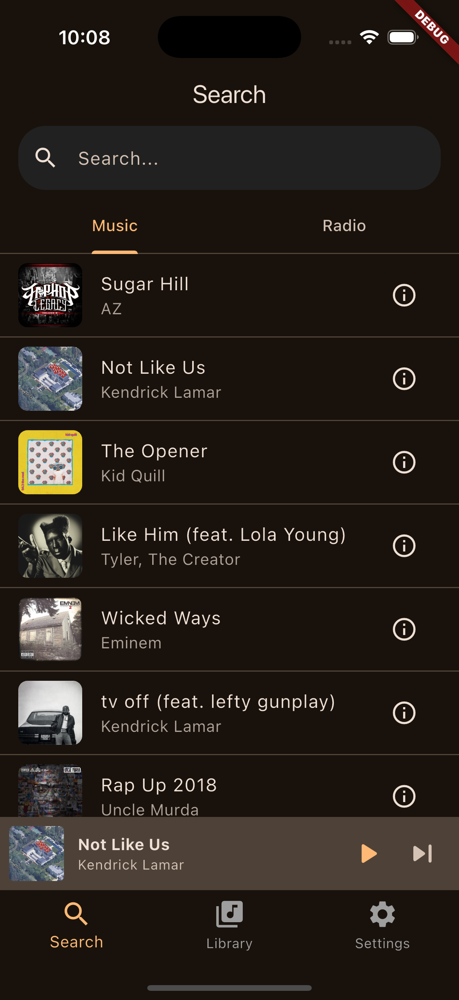

# LTunes

A modern, feature-rich Flutter music app for streaming, downloading, and organizing your music library. Built with performance and user experience in mind.

## ✨ Features

### 🎵 **Music Streaming & Playback**
- **Background Audio Service**: Seamless playback continues when app is minimized
- **Full-Screen Player**: Beautiful player with album art, controls, and lyrics view
- **Smart Queue Management**: Play songs, albums, playlists, or radio stations
- **Audio Controls**: Shuffle, repeat, seek, and volume control
- **Playback Speed Control**: Adjust playback speed from 0.25x to 3.0x with pitch correction (Android only)
- **Custom Speed Presets**: Create and save your favorite playback speeds (Android only)
- **Sleep Timer**: Set automatic playback stop with preset (15, 30, 60 min) or custom duration
- **Enhanced iOS Background Playback**: Optimized background audio continuity and session management
- **Bluetooth Device Support**: Automatic audio session activation for Bluetooth connections

### 🔍 **Advanced Search**
- **Global Music Search**: Find songs, albums, and artists instantly
- **Radio Station Search**: Discover US and global radio stations
- **Smart Caching**: Fast results with intelligent cache management and TTL
- **Debounced Search**: Optimized performance with 300ms search throttling
- **Real-time Results**: Instant search suggestions and filtering
- **Unified Library Search**: Search across all downloaded content, playlists, and recent radio stations

### 📚 **Modern Library Management**
- **Organized Categories**: Songs, Albums, Artists, Playlists, and Liked Songs
- **Smart Collections**: Recently added, recently played, and favorites
- **Import Local Files**: Add your own music with metadata extraction
- **Bulk Operations**: Select multiple items for batch actions
- **Search Within Library**: Find your content quickly with unified search
- **Download Indicators**: Visual indicators for downloaded content
- **Metadata History**: Track and manage local song metadata with persistent history
- **Recent Radio Stations**: Automatically track and display recently played radio stations

### 📱 **Download Management**
- **Background Downloads**: Download songs while using other apps
- **Progress Tracking**: Real-time download progress with system notifications
- **Queue Management**: Organize and prioritize downloads with configurable limits
- **Resume Support**: Continue interrupted downloads
- **Storage Management**: Monitor and clear downloaded content with detailed analytics
- **Concurrent Downloads**: Configurable concurrent download limits (1-10)
- **Retry Mechanism**: Automatic retry for failed downloads with exponential backoff (max 3 retries)
- **Download Notifications**: System notifications with progress updates and action buttons

### 🎼 **Playlist Features**
- **Create & Customize**: Build playlists with drag-and-drop support
- **Smart Playlists**: Auto-generated based on your listening habits
- **Collaborative Features**: Share and import playlists
- **Playlist Art**: Automatic artwork generation from included songs
- **Advanced Sorting**: Sort by name, date, or song count
- **Excel Import/Export**: Import playlists from Excel files with configurable matching

### 🎨 **Album & Artist Pages**
- **Rich Album Details**: Complete track listings and metadata
- **Artist Profiles**: Biography, popular tracks, and discography
- **Album Artwork**: High-quality cover art with fallback handling for both network and local files
- **Related Content**: Discover similar artists and albums
- **Saved Songs Filter**: Show only downloaded songs in albums
- **Album Play Count Tracking**: Automatic tracking of album playback statistics

### 🎤 **Lyrics & Media**
- **Synced Lyrics**: Timed lyrics display during playback
- **Plain Lyrics**: Full lyrics view for reading
- **Lyrics Search**: Find lyrics for any song
- **Album Art Display**: Full-screen artwork viewing
- **Metadata Support**: Complete song information

### ⚙️ **Settings & Customization**
- **Theme Support**: Light, dark, and system themes
- **Accent Colors**: Customize the app's color scheme
- **Radio Preferences**: US-only or global radio stations
- **Update System**: Automatic update notifications with configurable checking
- **Storage Analytics**: Monitor app storage usage with detailed breakdowns and charts
- **Cache Management**: Clear cached data and downloads
- **Download Settings**: Configure concurrent download limits and playlist matching
- **Listening Statistics**: Track your listening habits with detailed analytics and charts
- **Playback Speed Presets**: Create and manage custom playback speed presets

### 🔧 **Advanced Features**
- **Error Handling**: Comprehensive error management with retry mechanisms and user-friendly messages
- **Performance Optimization**: Lazy loading, caching, request limiting, and connection pooling
- **Offline Support**: Full functionality for downloaded content
- **Notification Integration**: System notifications for downloads and playback
- **Accessibility**: Screen reader support and keyboard navigation
- **iOS Background Playback**: Enhanced background audio support with periodic session checks
- **Bluetooth Integration**: Automatic audio session management for Bluetooth devices
- **Listening Statistics**: Track your listening habits with song, album, artist, and daily play counts
- **Metadata History**: Persistent history for local song metadata fetching

### 🐛 Bug Fixes
- Fixed album artwork flickering during screen transitions
- Improved audio session management on iOS
- Enhanced download queue stability
- Better handling of network interruptions
- Fixed playback speed persistence across app restarts
- Improved background playback continuity on iOS

## 📱 Screenshots

### Light Mode


### Dark Mode  


## 🛠️ Installation

### Prerequisites
- Flutter SDK ≥ 3.0.0
- Dart SDK ≥ 3.0.0
- Android Studio / VS Code with Flutter extensions

### Setup
1. **Clone the repository**:
   ```bash
   git clone https://github.com/LaganYT/LTunes-Flutter.git
   cd "LTunes Flutter"
   ```

2. **Install dependencies**:
   ```bash
   flutter pub get
   ```

3. **Run the app**:
   ```bash
   flutter run
   ```

### Platform Support
- ✅ **Android**: API 21+ (Android 5.0+)
- ✅ **iOS**: iOS 13.0+

## 🎯 Usage Guide

### Getting Started
1. **Search**: Use the search tab to find music and radio stations
2. **Library**: Access your downloaded content, playlists, and recent radio stations
3. **Settings**: Customize themes, preferences, and manage storage

### Key Features
- **Download Songs**: Tap the download icon to save songs offline
- **Create Playlists**: Use the library to organize your music
- **Background Playback**: Music continues when switching apps
- **Lyrics View**: Tap the lyrics button in the player for synchronized lyrics
- **Sleep Timer**: Set automatic playback stop in settings
- **Playback Speed**: Adjust speed in the full-screen player (Android only)
- **Custom Speed Presets**: Create your own speed presets in settings
- **Listening Statistics**: View your listening habits and preferences in settings
- **Unified Search**: Search across all your content from the library screen

## 🏗️ Architecture

### Core Services
- **ApiService**: Handles all API communication with caching, TTL, and request limiting
- **AudioHandler**: Manages background audio playback with iOS optimization
- **ErrorHandlerService**: Centralized error management with retry mechanisms
- **DownloadNotificationService**: System notification management for downloads
- **PlaylistManagerService**: Playlist CRUD operations with Excel import support
- **AlbumManagerService**: Album management and metadata handling
- **SleepTimerService**: Sleep timer functionality with preset and custom options
- **MetadataHistoryService**: Local song metadata history management
- **UnifiedSearchService**: Cross-library search functionality

### State Management
- **Provider Pattern**: Clean state management with Provider
- **CurrentSongProvider**: Global audio state management with playback speed control
- **Service Listeners**: Reactive updates across the app

### Performance Features
- **Request Debouncing**: Prevents excessive API calls with 300ms delay
- **Lazy Loading**: Loads content as needed for optimal performance
- **Connection Pooling**: Efficient HTTP client management
- **Cache TTL**: Time-based cache expiration with automatic cleanup
- **Concurrent Request Limiting**: Prevents API overload with configurable limits
- **Background Continuity**: iOS-specific background playback optimization

## 🔧 Development

### Project Structure
```
lib/
├── main.dart                 # App entry point with audio service initialization
├── models/                   # Data models (Song, Album, Playlist, etc.)
├── providers/                # State management (CurrentSongProvider)
├── screens/                  # UI screens (Search, Library, Settings, etc.)
├── services/                 # Business logic (API, Audio, Downloads, etc.)
└── widgets/                  # Reusable components (Player, Playbar, etc.)
```

### Key Dependencies
- **audio_service**: Background audio playback with iOS optimization
- **just_audio**: Audio player implementation with speed control
- **provider**: State management
- **http**: API communication with connection pooling
- **shared_preferences**: Local storage for settings and preferences
- **path_provider**: File system access for downloads
- **flutter_local_notifications**: Download progress notifications
- **excel**: Playlist import/export functionality
- **wakelock_plus**: Keep screen on during downloads
- **audio_session**: Enhanced audio session management
- **fl_chart**: Storage analytics and listening statistics charts
- **flutter_slidable**: Swipe actions for list items

### Error Handling
The app includes a comprehensive error handling system:
- **User-friendly messages**: Clear, actionable error descriptions
- **Retry mechanisms**: Automatic and manual retry options with exponential backoff
- **Error logging**: Centralized error tracking for debugging
- **Graceful degradation**: App continues working despite errors
- **Network resilience**: Handles network interruptions and reconnections

## 🤝 Contributing

We welcome contributions! Please follow these steps:

1. **Fork the repository**
2. **Create a feature branch**: `git checkout -b feature/YourFeature`
3. **Make your changes**: Follow the existing code style
4. **Test thoroughly**: Ensure all features work correctly
5. **Commit and push**: `git push origin feature/YourFeature`
6. **Open a Pull Request**: Provide a clear description of changes

### Development Guidelines
- Follow Flutter best practices and conventions
- Add error handling for new features
- Include appropriate tests
- Update documentation for new features
- Ensure cross-platform compatibility
- Consider performance implications for new features

## 📄 License

The Unlicense © Logan Latham / LaganDevs

This project is open source and available under the Unlicense, which means you can use, modify, and distribute it freely.

## 🙏 Acknowledgments

- **Flutter Team**: For the amazing framework
- **Audio Service Package**: For background audio support
- **Just Audio Package**: For reliable audio playback with speed control
- **Excel Package**: For playlist import/export functionality
- **Contributors**: Everyone who has helped improve LTunes

## 📞 Support

- **Issues**: Report bugs and request features on GitHub
- **Discussions**: Join community discussions
- **Documentation**: Check the code comments and error handling guide

---

**LTunes** - Your music, your way. 🎵
